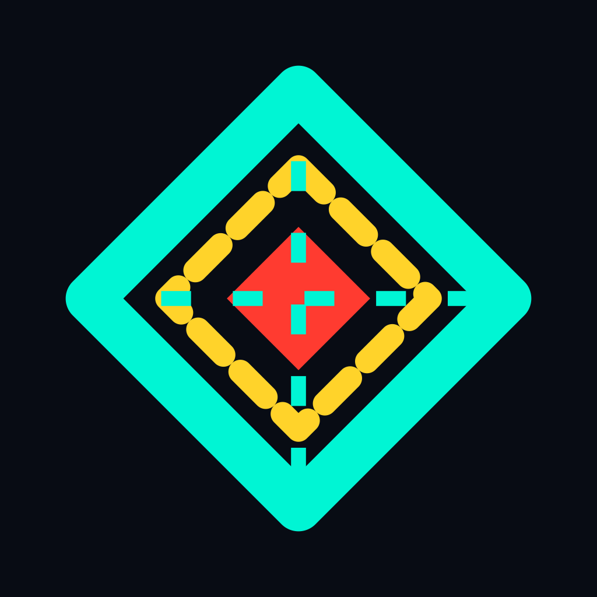
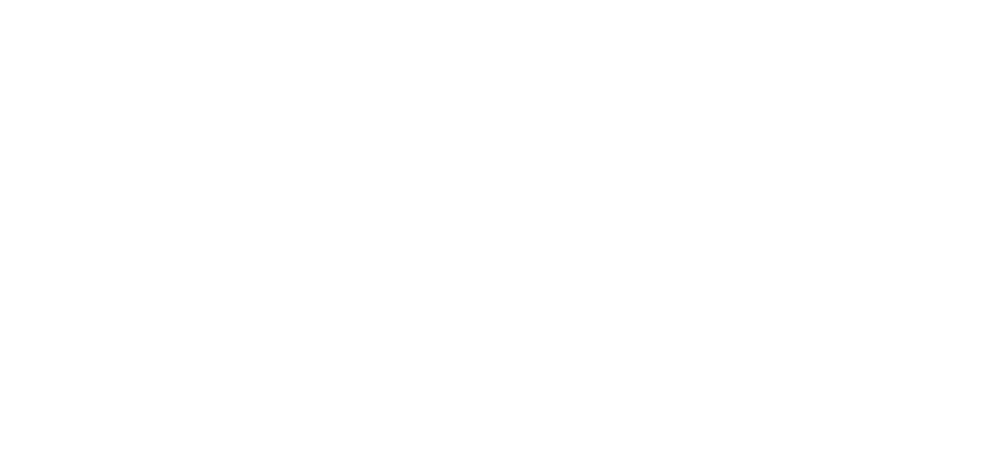

 

# MD ZISHAN TARIQUE

### Music Producer · Composer · Creative Technologist

Building music, creative tools, software and digital experiences.

 

---

## // 01 — SELECTED WORK

Software, creative tools and digital experiences.

<table>
<tr>
<td width="50%" valign="top">

&nbsp;&nbsp;<strong><a href="https://github.com/zishan049/Composer">Composer</a></strong>

Local-native creator studio and developer workbench.

Tauri · React · TypeScript

</td>
<td width="50%" valign="top">

&nbsp;&nbsp;<strong><a href="https://github.com/zishan049/Mage">Mage</a></strong>

Audio and file-management utility for music workflows.

Tauri · Audio · Desktop

</td>
</tr>

<tr>
<td width="50%" valign="top">

&nbsp;&nbsp;<strong><a href="https://github.com/zishan049/TaskManager">Task Manager</a></strong>

Productivity and task-management application.

Desktop · Productivity

</td>
<td width="50%" valign="top">

&nbsp;&nbsp;<strong><a href="https://github.com/zishan049/Chat">Chat</a></strong>

Communication and real-time messaging project.

Realtime · Android · Experiment

</td>
</tr>

<tr>
<td width="50%" valign="top">

&nbsp;&nbsp;<strong><a href="https://github.com/zishan049/The-Nandi-Studio">The Nandi Studio</a></strong>

Cinematic digital studio experience.

React · Supabase · Web

</td>
<td width="50%" valign="top">

&nbsp;&nbsp;<strong><a href="https://github.com/zishan049/Syncd">SyncD</a></strong>

Synchronized interaction and shared digital experiences.

Web · Realtime · Systems

</td>
</tr>
</table>

---

## // 02 — TECHNOLOGY

 

**Frontend** — React · TypeScript · JavaScript · Tailwind CSS · Vite  
**Backend** — Node.js · Express · Supabase  
**Desktop** — Tauri  
**Database** — PostgreSQL · MySQL  
**Media / 3D** — FFmpeg · Three.js  
**Deployment / VCS** — Vercel · GitHub

---

## // 03 — MUSIC

### MUSIC VIBE

**Music Producer · Composer**

I produce and compose across **electronic, cinematic, trap, phonk, orchestral, ambient and experimental** styles.

Music is the core of what I do. Software and design are the tools I use to build around it.

<table>
<tr>
<td valign="middle" width="88">

</td>
<td valign="middle">

<strong>MUSIC VIBE</strong>  
Music Producer · Composer  
@musicvibe725 · India

</td>
<td valign="middle" width="45%">

</td>
</tr>
</table>

**Music** · **Technology** · **Design** · **Creative Tools**

  

---

## // 04 — GITHUB

<a href="https://github.com/zishan049?tab=repositories">View all repositories →</a>
&nbsp;&nbsp;·&nbsp;&nbsp;
<a href="https://github.com/zishan049">View GitHub profile →</a>

  

---

## // 05 — CONNECT

<a href="https://github.com/zishan049">GitHub</a>
&nbsp;·&nbsp;
<a href="https://musicvibe-delta.vercel.app/">Website</a>
&nbsp;·&nbsp;
<a href="https://open.spotify.com/artist/5ERUSqkyJrIgjkwfvBxu6U">Spotify</a>
&nbsp;·&nbsp;
<a href="https://on.soundcloud.com/LiRj3ENP0rJ03eITYH">SoundCloud</a>
&nbsp;·&nbsp;
<a href="https://www.instagram.com/musicvibe725">Instagram</a>

  

India · Music · Software · Design

 

Built with curiosity. Driven by experimentation.

